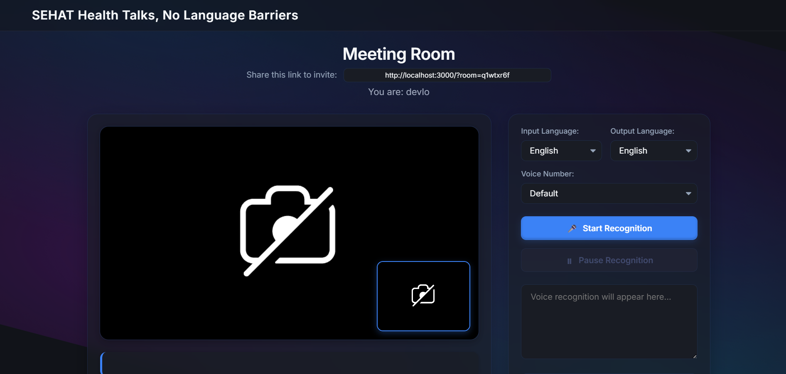

# SEHAT: Multilingual Video Consultation Platform 🌐



[](https://opensource.org/licenses/MIT)
[](https://nodejs.org)
[](http://makeapullrequest.com)

**SEHAT** is a modern, multilingual video consultation platform designed to break down language barriers. Using real-time speech recognition, translation, and synthesis, it enables seamless communication between users speaking different languages.

---

## 📜 Table of Contents

- [About The Project](#about-the-project)
- [Key Features](#-key-features)
- [Built With](#-built-with)
- [Getting Started](#-getting-started)
  - [Prerequisites](#prerequisites)
  - [Installation](#installation)
- [Usage](#-usage)
- [Deployment](#-deployment)
- [Contributing](#-contributing)
- [License](#-license)

---

## 📖 About The Project

In an increasingly connected world, language differences can be a significant obstacle to effective communication, especially in critical sectors like healthcare and international business. **SEHAT** (meaning "health" in Hindi) addresses this challenge head-on by providing an intuitive video calling experience with powerful, real-time translation capabilities.

This project integrates secure WebRTC video streams with the Google Translate API to capture, translate, and voice-synthesize conversations, allowing all participants to communicate effortlessly in their native language.

---

## ✨ Key Features

- **Secure Video Meetings**: Peer-to-peer, encrypted video and audio streams powered by WebRTC.
- **Real-time Translation**: Instant speech recognition and translation between multiple languages.
- **Multilingual Support**: Supports a wide range of languages including English, Hindi, Kannada, and more.
- **Voice Synthesis**: Reads translated text aloud, creating a natural conversational flow.
- **Room-Based Meetings**: Simple, shareable links for joining private consultation rooms.
- **Responsive UI**: A clean, modern, and easy-to-use interface that works on all devices.

---

## 🛠️ Built With

This project leverages a modern tech stack to deliver a real-time experience:

- **[Node.js](https://nodejs.org/)**: Server-side JavaScript runtime.
- **[Express.js](https://expressjs.com/)**: Minimalist web framework for Node.js.
- **[Socket.IO](https://socket.io/)**: Enables real-time, bidirectional event-based communication.
- **[WebRTC](https://webrtc.org/)**: Provides peer-to-peer communication capabilities in the browser.
- **[Google Cloud Translate API](https://cloud.google.com/translate)**: Powers the speech recognition and translation features.

---

## 🚀 Getting Started

To get a local copy up and running, follow these simple steps.

### Prerequisites

Ensure you have the following installed on your machine:
- **Node.js**: Version 16 or higher.
- **Google Cloud Translate API Key**: You'll need credentials for the Google Cloud Translate API. You can get them [here](https://cloud.google.com/translate/docs/setup).

### Installation

1.  **Clone the repository:**
    ```sh
    git clone [https://github.com/your-username/sehat-video-platform.git](https://github.com/your-username/sehat-video-platform.git)
    cd sehat-video-platform
    ```

2.  **Install NPM packages:**
    ```sh
    npm install
    ```

3.  **Set up environment variables:**
    Create a `.env` file in the root of your project and add the following variables:
    ```env
    # Your Google Cloud Translate API Key
    GOOGLE_TRANSLATE_API_KEY=your_google_api_key

    # The port the server will run on
    PORT=3000
    ```

4.  **Run the application:**
    ```sh
    node index.js
    ```
    The application will be available at [http://localhost:3000](http://localhost:3000).

---

## 👨‍💻 Usage

1.  Open the application in your browser.
2.  Enter your name to create a new meeting room.
3.  Share the generated meeting link with others to invite them to the room.
4.  Once in the call, select your preferred input (speaking) and output (listening) languages from the dropdown menus.
5.  Start your conversation! The platform will handle the translation in real-time.

---

## ☁️ Deployment

This application is ready for deployment on modern cloud platforms.

- **Supported Platforms**: Railway, Render, Fly.io, Heroku, and similar services.
- **HTTPS Required**: For production environments, WebRTC requires a secure context (HTTPS) to access user media devices (camera and microphone). Ensure your deployment platform provides SSL termination.

---

## 🤝 Contributing

Contributions are what make the open-source community such an amazing place to learn, inspire, and create. Any contributions you make are **greatly appreciated**.

To contribute:
1.  Fork the Project.
2.  Create your Feature Branch (`git checkout -b feature/AmazingFeature`).
3.  Commit your Changes (`git commit -m 'Add some AmazingFeature'`).
4.  Push to the Branch (`git push origin feature/AmazingFeature`).
5.  Open a Pull Request.

---

## 📄 License

Distributed under the MIT License. See `LICENSE` for more information.